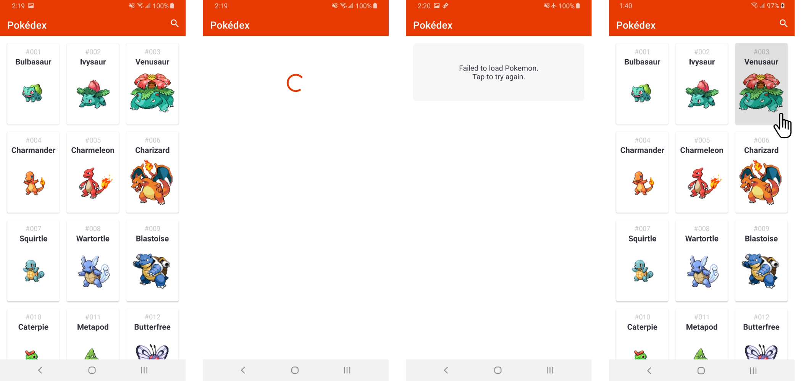
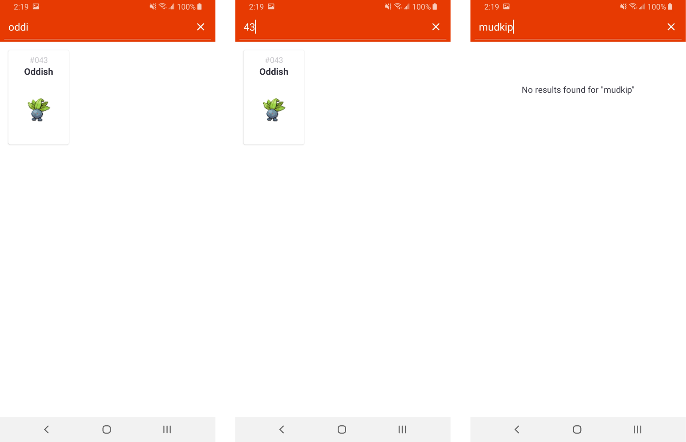
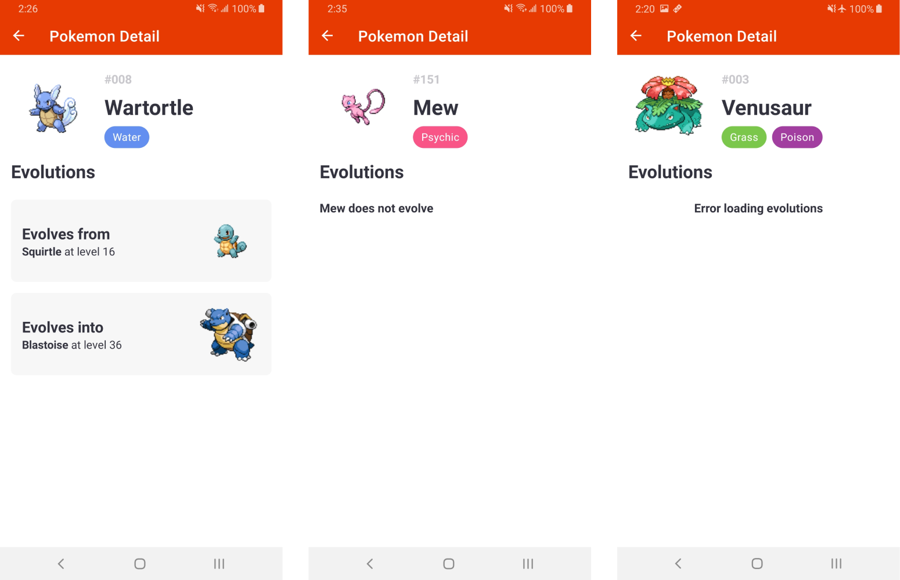

# Pokedex App

## Project Brief

This repository contains an app that we'd like you to work on.
The app has 16 (or more) issues that we'd like to get fixed.

The types of issues you'll encounter include:
- UI/UX
- Performance issues
- Logical and functional bugs
- Ignored common best practices

Your goal is to take this project and turn it in to something that you’re satisfied with.
Please make use of the NOTES.md for anything you'd like us to know about your submission.

## Project Specifications

**General**

- The app should match the design specifications. Exact colors and spacing are not required, but general element positioning should be taken into account.
- The app has some UX issues which causes inconvenience in app use. Please find and fix them as well. 
- The app architecture isn't great but please don't refactor it. We value your time and instead encourage to just put notes with proposed changes (if any) into NOTES.md.

### Pokemon List

**General** 
- I should be able to tap a Pokemon and see the Pokemon Details
- I should see a loading state when loading the Pokemon from the API
- I should see a failed state if loading the Pokemon from the API fails
- I should also be given the option to reload/retry from this error state

**Search**
- I should be able to tap the search icon/bar and be able to filter the list of Pokemon by _Name_ OR _ID_
- I should see a "No results" state when there are no pokemon that match the search query

### Pokemon Details

**General**

- I should be able to see the Pokemon's Types

**Evolutions**

- I should be able to see which Pokemon evolves into, and which Pokemon evolves from the current Pokemon if either cases exists. 
- If the Pokemon does not evolve into, or from another Pokemon, then a label should state this.
- I should be able to tap on an evolution and be shown the Pokemon Details of that Pokemon

## Designs





## API Documentation

It is a small API. There are currently only two endpoints:

### GET /pokemon
Returns a list of all Pokemon in the database. Example response:

```
[
  {
    "id": 1,
    "identifier": "bulbasaur",
    "types": [
      {"id": 12, "identifier": "grass"},
      {"id": 4, "identifier": "poison"}
    ]
  },
  {
    "id": 2,
    "identifier": "ivysaur",
    "types": [
      {"id": 12, "identifier": "grass"},
      {"id": 4, "identifier": "poison"}
    ]
  },
  ...
```

### GET /pokemon/:id/evolutions
Returns the evolution data for the Pokemon with `id`. This will contain up to two nested objects `evolves_from` and `evolves_into` depending on the evolution chain of the Pokemon. 

For example, fetching Ivysaur's evolution data will return:

```
[
  {
    "evolves_from": 1,
    "trigger": "at level 16"
  },
  {
    "evolves_into": 3,
    "trigger": "at level 32"
  }
]
```
